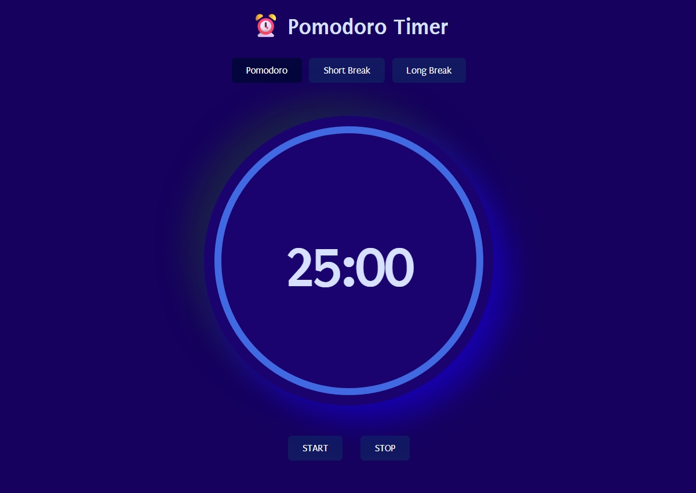

#  Pomodoro Timer
 A simple, clean focus timer to help you stay productive! Use it for studying, working, or building good habits — with 3 timer lengths to choose from.
 ## ✨ Features
 -  **3 Timer Modes**: 25-minute work, 5-minute short break, 10-minute long break
 -  **Easy Controls**: Startand pause your timer with one click
 -  **Clean Design**: Big clear numbers and smooth blue progress ring
 -  **Works Everywhere**: Looks great on phones, tablets, and laptops
 ## 🚀 How to Use
 1. Pick your timer length at the top: **Pomodoro**, **Short Break**, or **Long Break**
 2. Click **START** to begin counting down
 3. Click **PAUSE** if you need to stop for a moment
 ## Screenshot
 
 ##  Made With
 Plain HTML
 Simple CSS styling
 JavaScript

## 
